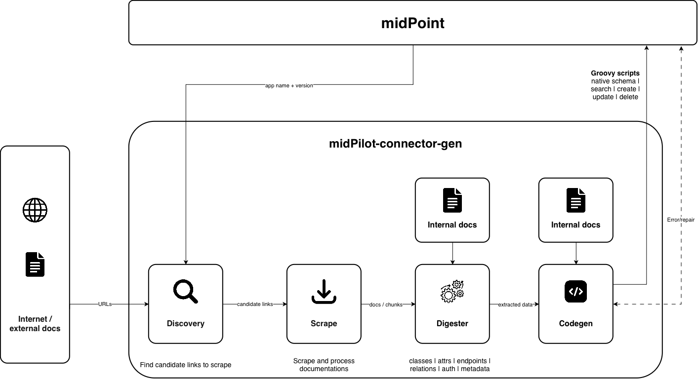

= Generation pipeline
:toc: left

link:../index.adoc[← Documentation index]

Connector generation is a four-stage pipeline. Each stage reads what the
previous stages stored in the link:../sessions-and-jobs.adoc[session] and
writes its own results back to it:

[cols="1,2,2", options="header"]
|===
| Stage | Input | Output (stored in session)

| link:discovery.adoc[Discovery]
| Application name (+ version, protocol priority)
| Ranked candidate documentation URLs

| link:scrape.adoc[Scrape]
| Starter URLs (typically the discovery output)
| Processed documentation chunks (`documentation_items`)

| link:digester.adoc[Digester]
| Documentation chunks
| Metadata (incl. link:../api-type.adoc[apiType]), auth methods, object
  classes, endpoints, attributes, relations, connectivity endpoint

| link:codegen.adoc[Codegen]
| Digester outputs + relevant chunks
| Groovy connector code per operation (schema, search, CRUD, auth, relations)
|===

== Stage dependencies and recommended order

The stages must run in order, but there are dependencies *inside* the digester
and codegen stages too. The recommended full sequence is:

1. Create a session (`POST /api/session`).
2. *Discovery* — or skip it if you already know the documentation URLs.
3. *Scrape* the URLs — or upload documentation files directly
   (see link:../sessions-and-jobs.adoc[Sessions and jobs]).
4. *Digester*, in this order:
   a. `metadata` — detects link:../api-type.adoc[apiType] and the protocol's
      connection target (base API URL or SQL database name); *run this first*,
      later protocol-specific steps depend on it,
   b. `auth`,
   c. `classes` (object classes),
   d. per object class: `endpoints`, then `attributes`,
   e. `relations`, `connectivity-endpoint`.
5. *Codegen*: `authorization`, then per object class `native-schema`,
   `connid`, `search/{intent}`, `create`, `update`, `delete`, and
   `relations/{relationName}`.

IMPORTANT: If digester metadata extraction is skipped or detects the wrong
protocol, every subsequent protocol-specific step silently uses the wrong
extractor or prompt family (REST behavior for a SCIM or SQL target, etc.). See
link:../api-type.adoc[API type] for how detection works and how to override it.

=== The SQL variant

A database connector uses the same session, digester, and codegen model, while
bypassing web discovery and scraping:

1. Create a session.
2. *Discovery* — skipped; a database is not found by web search.
3. *Scrape* — skipped; upload the schema instead. Either the midPoint conndev
   SQL export (one document per object class), raw `CREATE TABLE` DDL, or a
   JSON table list.
4. Establish `apiType: ["sql"]`: either run digester `metadata` (the
   documentation signal is the only detection signal that can select SQL) or
   declare it with `PUT /api/digester/{sessionId}/metadata`. Uploading or
   tagging a conndev document does not itself persist session metadata.
5. *Digester*: `classes` → per class `attributes` (which reads the columns and
   records the table each one maps to). `endpoints` is rejected for a SQL
   session — a database connector has no endpoints. The shared `auth`,
   `relations`, and `connectivity-endpoint` extractors have no SQL-specific
   behavior and are skipped in the normal SQL flow.
6. *Codegen*: per object class `native-schema`, `connid`, `search/{intent}`,
   `create`, `update`, `delete`. `authorization` has no SQL prompt family;
   relation code requires a manually supplied or otherwise extracted relation.

See link:../api-type.adoc[API type] and link:digester.adoc[Digester] for what
each source of schema provides.

NOTE: Every stage is exposed as an asynchronous job: `POST` starts it and
returns a `jobId`, `GET` on the same path polls the status/result. See
link:../sessions-and-jobs.adoc[Sessions and jobs].
